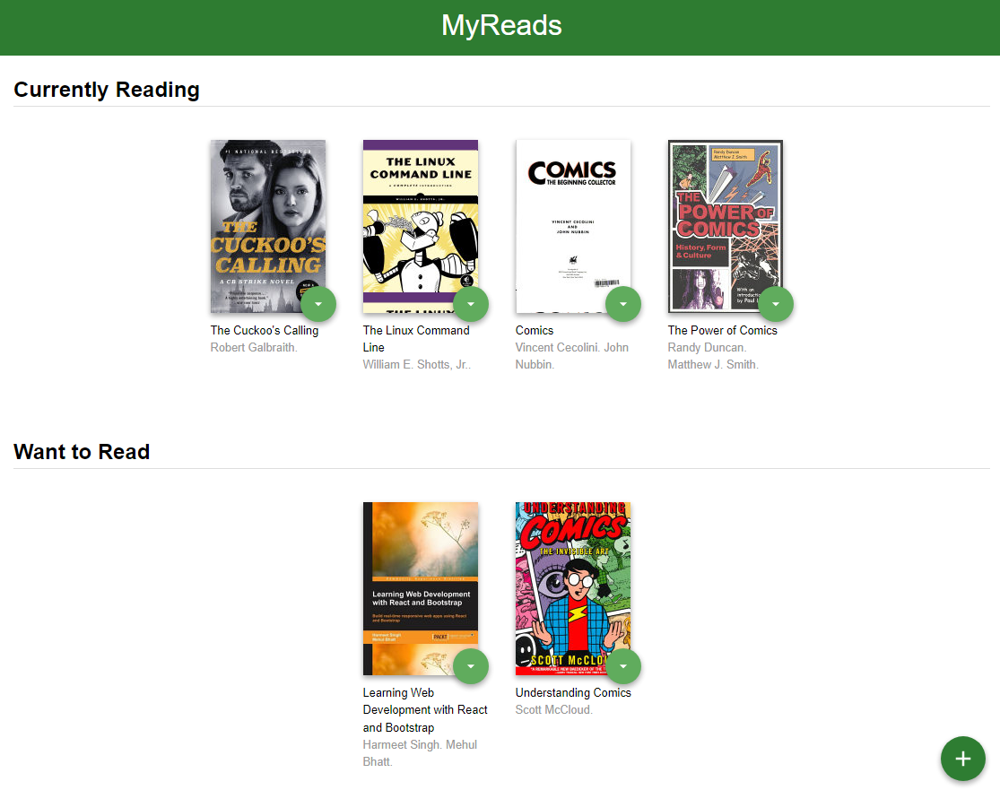

# MyReads Project

This is project number 1 of the [Udacity React Nanodegree](https://www.udacity.com/course/react-nanodegree--nd019).

## Running the code

To get started developing right away:

- download (or fork and download) this repo by running `git clone https://github.com/malaktayeh/reactnd-project-myreads-starter` in your terminal
- install all project dependencies with `npm install`
- start the development server with `npm start`

You can also run in in the browser! Press `.` on this page or [here](https://github.dev/malaktayeh/reactnd-project-myreads-starter) to launch (:

## Requirements

- [Node.js](https://nodejs.org/) and [npm](https://www.npmjs.com/)
- A code editor (I use [VS Code](https://code.visualstudio.com/))
